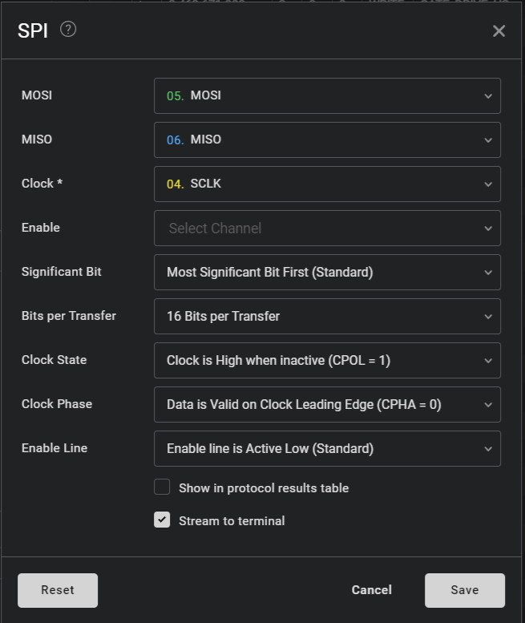
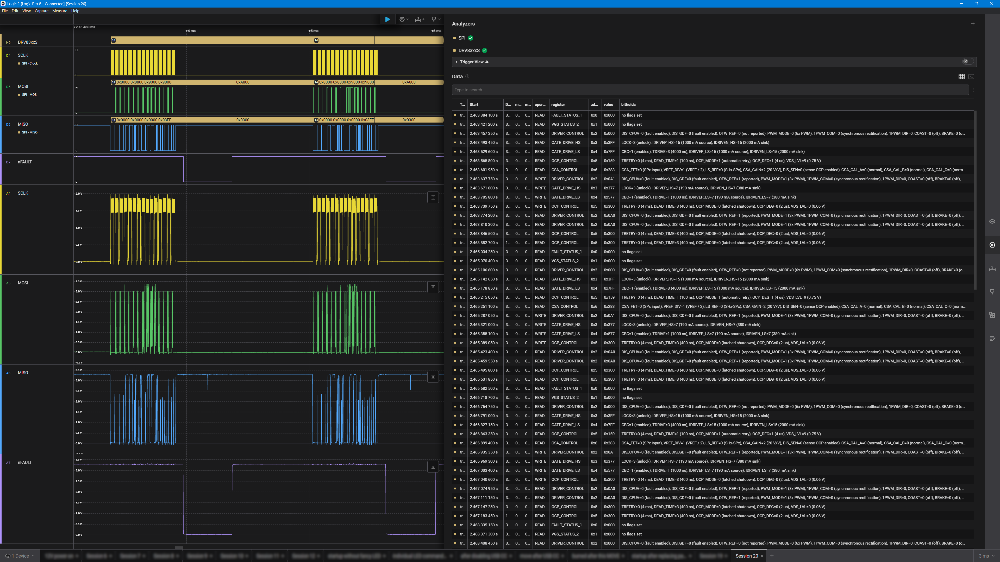

This is High Level Analyzer for Saleae Logic 2.  It decodes for the Texas Instruments DRV8323S/DRV8323RS gate-driver protocol.

Each 16-bit SPI transaction is displayed as:
```text
READ | DRIVER_CONTROL | 0x2 | 0x0A0 | DIS_CPUV=0 (fault enabled), ... PWM_MODE=1 (3x PWM), ...
WRITE | GATE_DRIVE_HS | 0x3 | 0x377 | LOCK=3 (unlock), IDRIVEP_HS=7 (190 mA source), ...
```

The data table also contains separate operation, register, address, value, bitfields, MOSI, and MISO columns.

# Logic 2 setup
1. Add a standard **SPI** analyzer
2. Assign `SDI` to MOSI, `SDO` to MISO, and the selected driver's `nSCS` to Enable (optional)
3. Configure:
   * **Significant Bit**: `Most Significant Bit First (Standard)`
   * **Bits per Transfer**: `16 Bit per Transfer`
   * **Clock State**: `Clock is High when inactive (CPOL = 1)` -- this is how TI uses SPI
   * **Clock Phase**: `Data is Valid on Clock Leading Edge (CPHA = 0)` -- this is also a TI convention
   * **Enable Line**: `Active Low (nSCS)` -- OK to ignore if you're not sampling the enable line (like in the screenshot below)
4. Add this **DRV8323S** High Level Analyzer on top of the SPI analyzer
5. Select "SPI" as the Input Analyzer



# Screenshot
